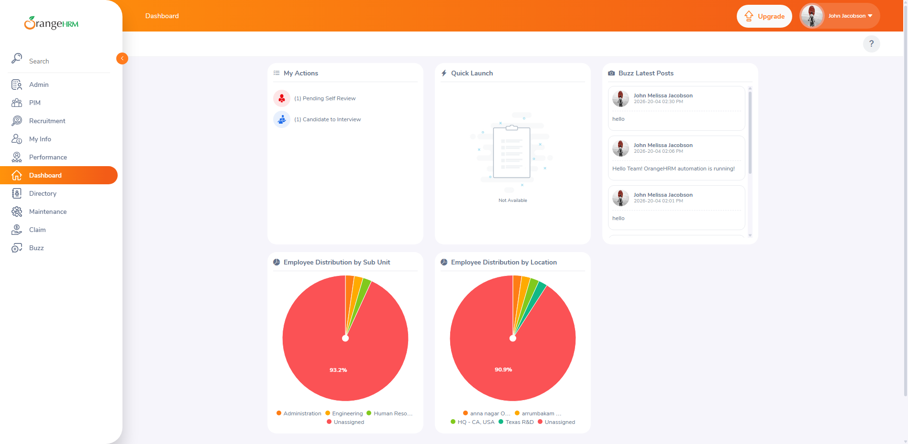
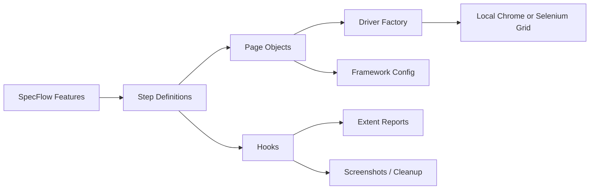

# OrangeHRM UI Automation Framework in C#

[](https://dotnet.microsoft.com/)
[](https://www.selenium.dev/)
[](https://specflow.org/)
[](https://www.docker.com/)
[](https://github.com/Ajaythakur15/SeleniumCSharpBDD/actions)
[](https://github.com/ajay9761/SeleniumCSharpBDD/actions/workflows/e2e-docker.yml)

Production-style Selenium automation framework for OrangeHRM built with C#, SpecFlow, NUnit, Dockerized Selenium Grid, and Extent Reports.

This project demonstrates how to design a maintainable UI automation framework that supports:

- local browser execution
- remote Selenium Grid execution
- CI execution in GitHub Actions
- environment-driven configuration
- reusable Page Object Model design
- HTML reporting with screenshots

Repository:

- [Ajaythakur15/SeleniumCSharpBDD](https://github.com/Ajaythakur15/SeleniumCSharpBDD.git))

Application under test:

- `https://opensource-demo.orangehrmlive.com/`

## Demo Snapshot



## Why This Project Is Strong for Portfolio / Interview Use

This is not just a test script collection. It shows framework-level thinking:

- BDD scenario design with SpecFlow
- reusable driver factory for local and Grid execution
- CI-friendly stability improvements for headless and Docker runs
- modular page objects with module-specific validations
- test-data cleanup handling
- artifact publishing through GitHub Actions

## Feature Highlights

- Selenium WebDriver with C# and .NET 8
- SpecFlow Gherkin scenarios with tagged execution
- NUnit test execution
- Local Chrome and Docker Grid browser switching
- Extent HTML reports and failure screenshots
- Retry for transient WebDriver/Grid startup failures
- Click hardening for headless/CI environments
- Config through `appsettings.json` plus environment overrides
- GitHub Actions CI pipeline

## Current Coverage

### Login

- Valid admin login

### OrangeHRM module validation

- Admin
- PIM
- Leave
- Time
- Recruitment
- My Info
- Performance
- Dashboard
- Directory
- Maintenance
- Claim
- Buzz

### End-to-end flow

- Create employee in PIM
- Search employee in PIM
- Delete employee in PIM
- Verify the employee no longer appears in search results

## Architecture

```text
SeleniumCSharpBDD
|-- .github/workflows/        # GitHub Actions CI
|-- Drivers/                  # Local/Grid WebDriver creation
|-- Features/                 # SpecFlow feature files
|-- Hooks/                    # Before/After scenario hooks
|-- Pages/                    # Page objects
|   `-- Modules/              # Module-specific page objects
|-- StepDefinitions/          # Step bindings
|-- Utils/                    # Config, reporting, screenshots, test-data helpers
|-- docs/assets/              # README screenshots/media
|-- docker-compose.yml        # Selenium Grid + test runner
|-- Dockerfile                # Test execution image
|-- appsettings.json          # Default settings
`-- SeleniumCSharpBDD.csproj  # .NET test project
```



## Tech Stack

| Area | Technology |
| --- | --- |
| Language | C# |
| Runtime | .NET 8 |
| UI Automation | Selenium WebDriver |
| BDD | SpecFlow |
| Test Runner | NUnit |
| Reporting | Extent Reports |
| Containers | Docker |
| Remote Browser Execution | Selenium Grid |
| CI/CD | GitHub Actions |

## Execution Modes

### Local execution

```powershell
dotnet test
```

### Local headless execution

```powershell
$env:HEADLESS="true"
dotnet test
```

### Docker Grid from host

```powershell
docker compose up -d selenium

$env:SELENIUM_REMOTE_URL="http://localhost:4444/wd/hub"
$env:HEADLESS="true"
$env:REPORT_DIR="C:\QA\SeleniumCSharpBDD\TestResults"
dotnet test
```

### Full Docker execution

```powershell
docker compose up --build --abort-on-container-exit
```

## Selenium Grid URLs

- Grid UI: `http://localhost:4444/ui`
- Grid status: `http://localhost:4444/status`
- noVNC browser view: `http://localhost:7900`

## Configuration

The framework supports `appsettings.json` defaults with environment-variable overrides.

### Main settings

| Variable | Default | Purpose |
| --- | --- | --- |
| `APP_URL` | OrangeHRM demo URL | Target application |
| `BROWSER` | `chrome` | Browser selection |
| `HEADLESS` | `true` | Headless browser execution |
| `SELENIUM_REMOTE_URL` | empty | Empty = local browser, populated = Grid |
| `REPORT_DIR` | `TestResults/<timestamp>` | Report and screenshot output folder |
| `RUN_NAME` | timestamp | Run folder name |
| `DRIVER_STARTUP_RETRIES` | `2` | Retry count for transient startup failures |
| `EXPLICIT_WAIT_SECONDS` | `20` | Explicit wait timeout |
| `CHROME_BINARY_PATH` | empty | Optional Chrome binary path |
| `CHROME_USER_DATA_DIR` | temp profile | Optional isolated Chrome profile |

Local template:

```text
.env.example
```

## Test Tags

```powershell
dotnet test --filter "TestCategory=smoke"
dotnet test --filter "TestCategory=regression"
dotnet test --filter "TestCategory=pim"
dotnet test --filter "TestCategory=docker"
dotnet test --filter "TestCategory=login"
```

## Reporting

The framework produces:

- Extent HTML report
- failure screenshots

Default output:

```text
TestResults/<run timestamp>/ExtentReport.html
TestResults/<run timestamp>/Screenshots/
```

## CI Pipeline

GitHub Actions workflow:

```text
.github/workflows/e2e-docker.yml
```

What it does:

- checks out the repo
- runs the suite through Docker Compose
- starts Selenium standalone Chrome and the test container
- exits the workflow with the test container's result
- uploads the full report bundle, HTML report, screenshots, and Docker logs as artifacts

## Stability Enhancements

- explicit waits instead of sleep-based timing
- resilient click handling for intercepted clicks
- scroll + JavaScript click fallback
- isolated Chrome profile handling
- retry logic for transient WebDriver/Grid startup failures
- test-data registry and cleanup support

## Windows Troubleshooting

### Chrome crash / crashpad / access denied

```powershell
Get-Process chrome,chromedriver -ErrorAction SilentlyContinue | Stop-Process -Force
```

Retry with an isolated profile:

```powershell
$env:HEADLESS="true"
$env:CHROME_USER_DATA_DIR="C:\Temp\orangehrm-chrome-profile"
dotnet test
```

### Docker engine issues

```powershell
docker version
docker context ls
docker context use desktop-linux
```

If Docker still hangs:

```powershell
wsl --shutdown
```

## What This Project Demonstrates

- framework design for UI automation in C#
- BDD implementation with SpecFlow
- Docker-based remote execution
- CI integration with GitHub Actions
- handling flaky UI behavior in headless environments
- maintainable Page Object Model structure

## Recommended Next Enhancements

- add richer CRUD coverage for Admin and Recruitment modules
- split smoke and regression into separate CI jobs
- add Allure or richer trend reporting if needed
- introduce test-data builders/factories for complex workflows
